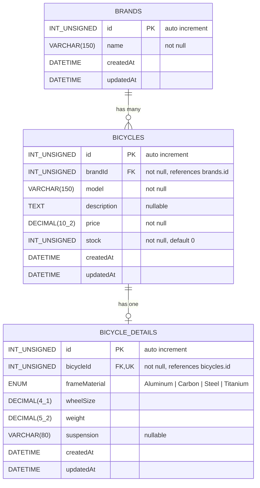

# Bicycle Shop

Bicycle Shop is a full-stack learning project that manages the catalogue of a bicycle shop. It exposes a REST API built with **TypeScript, Express and Sequelize** on top of a **MySQL** database, and a **React + Vite** frontend (styled with Tailwind CSS) that consumes the API to create, read, update and delete bicycles. The data model has three related entities: **brands**, **bicycles** and **bicycle details**. A brand has many bicycles (one-to-many), and each bicycle can have one technical detail sheet with its frame material, wheel size, weight and suspension (one-to-one). The API provides full CRUD for the three resources, plus eager-loading endpoints such as getting a bicycle with its brand or listing all bicycles filtered by frame material.

## Getting Started

These instructions will get you a copy of the project up and running on your local machine for development and testing purposes. See [Deployment](#deployment) for notes on how to deploy the project on a live system.

### Prerequisites

What you need to install before starting:

- [Git](https://git-scm.com/)
- [Node.js](https://nodejs.org/) with npm (a version compatible with Vite, e.g. Node.js 22.12+)
- [MySQL](https://dev.mysql.com/downloads/) server (running before you start the backend)

Check your versions:

```bash
git --version
node --version
npm --version
mysql --version
```

### Installing

A step by step series of examples that tell you how to get a development environment running.

**1. Clone the repository**

```bash
git clone <repository-url>
cd bicycle-shop-dsw-entrega-03
```

**2. Create the database**

Connect to MySQL (MySQL Workbench or the command-line client):

```bash
mysql -u root -p
```

And execute:

```sql
CREATE DATABASE IF NOT EXISTS db_bicycle_shop CHARACTER SET utf8mb4;
```

Sequelize creates the tables (`brands`, `bicycles` and `bicycle_details`) automatically when the backend starts; only the database itself must exist.

**3. Configure the backend environment**

Create a `.env` file inside `backend/` (you can copy `backend/.env.example`):

```dotenv
PORT=3000
DB_HOST=localhost
DB_PORT=3306
DB_NAME=db_bicycle_shop
DB_USER=your-database-username
DB_PASSWORD=your-database-password
```

**4. Configure the frontend environment**

Create a `.env` file inside `frontend/` (you can copy `frontend/.env.example`):

```dotenv
VITE_API_URL=http://localhost:3000/api
```

Do not add a trailing slash or `/bicycles`; the frontend appends the endpoint paths itself.

**5. Install dependencies**

```bash
cd backend
npm ci
cd ../frontend
npm ci
cd ..
```

**6. Start both applications**

In a first terminal, start the backend:

```bash
cd backend
npm run dev
```

In a second terminal, start the frontend:

```bash
cd frontend
npm run dev
```

The API runs at [http://localhost:3000/api](http://localhost:3000/api) and the frontend at the URL printed by Vite, usually [http://localhost:5173](http://localhost:5173).

> **Note:** the backend currently calls `sequelize.sync({ force: true })`, which **drops and recreates the tables every time the server starts**. Switch to `sequelize.sync()` in `backend/src/server.ts` if you want to keep your data between restarts.

**7. Try it out**

Create a brand, a bicycle and its technical details, then list all carbon bicycles with their details:

```bash
curl -X POST http://localhost:3000/api/brands -H "Content-Type: application/json" -d '{"name":"Orbea"}'

curl -X POST http://localhost:3000/api/bicycles -H "Content-Type: application/json" -d '{"brandId":1,"model":"Orca M30","description":"Road bike","price":2499.99,"stock":3}'

curl -X POST http://localhost:3000/api/bicycle-details -H "Content-Type: application/json" -d '{"bicycleId":1,"frameMaterial":"Carbon","wheelSize":28,"weight":8.35,"suspension":null}'

curl http://localhost:3000/api/bicycles/eagerly/frame-material/Carbon
```

Example response:

```json
[
  {
    "id": 1,
    "brandId": 1,
    "model": "Orca M30",
    "description": "Road bike",
    "price": "2499.99",
    "stock": 3,
    "createdAt": "2026-09-30T10:00:00.000Z",
    "updatedAt": "2026-09-30T10:00:00.000Z",
    "detail": {
      "id": 1,
      "bicycleId": 1,
      "frameMaterial": "Carbon",
      "wheelSize": "28.0",
      "weight": "8.35",
      "suspension": null,
      "createdAt": "2026-09-30T10:01:00.000Z",
      "updatedAt": "2026-09-30T10:01:00.000Z"
    }
  }
]
```

## API Endpoints

### Brands

| Method | Endpoint           | Description       |
| ------ | ------------------ | ----------------- |
| GET    | `/api/brands`      | List all brands   |
| GET    | `/api/brands/:id`  | Get a brand by id |
| POST   | `/api/brands`      | Create a brand    |
| PUT    | `/api/brands/:id`  | Update a brand    |
| DELETE | `/api/brands/:id`  | Delete a brand    |

### Bicycles

| Method | Endpoint                                          | Description                                                         |
| ------ | ------------------------------------------------- | ------------------------------------------------------------------- |
| GET    | `/api/bicycles`                                   | List all bicycles                                                   |
| GET    | `/api/bicycles/:id`                               | Get a bicycle by id                                                 |
| GET    | `/api/bicycles/eagerly/:id`                       | Get a bicycle by id including its brand                             |
| GET    | `/api/bicycles/eagerly/frame-material/:frameMaterial` | List bicycles (with their details) whose frame is of that material |
| POST   | `/api/bicycles`                                   | Create a bicycle                                                    |
| PUT    | `/api/bicycles/:id`                               | Update a bicycle                                                    |
| DELETE | `/api/bicycles/:id`                               | Delete a bicycle (its details are deleted in cascade)               |

### Bicycle details

| Method | Endpoint                              | Description                                   |
| ------ | ------------------------------------- | --------------------------------------------- |
| GET    | `/api/bicycle-details`                | List all bicycle details                      |
| GET    | `/api/bicycle-details/:id`            | Get bicycle details by id                     |
| GET    | `/api/bicycle-details/eagerly/:id`    | Get bicycle details by id (eager loading)     |
| POST   | `/api/bicycle-details`                | Create the details of a bicycle               |
| PUT    | `/api/bicycle-details/:id`            | Update bicycle details                         |
| DELETE | `/api/bicycle-details/:id`            | Delete bicycle details                        |

Valid values for `frameMaterial`: `Aluminum`, `Carbon`, `Steel`, `Titanium`.

### POSTMAN

The full API documentation and request collection is available on Postman:

https://documenter.getpostman.com/view/58320210/2sBYB4L76L

## Database Schema

- A brand has many bicycles; each bicycle belongs to one brand (`bicycles.brandId` → `brands.id`, `ON UPDATE CASCADE`, `ON DELETE RESTRICT`).
- A bicycle has at most one detail sheet; each detail belongs to one bicycle (`bicycle_details.bicycleId` → `bicycles.id`, unique, `ON DELETE CASCADE`).



## Running the tests

The project does not include automated tests yet. The API can be tested manually with the [Postman collection](https://documenter.getpostman.com/view/58320210/2sBYB4L76L) or with `curl`, as shown above.

### Break down into end to end tests

The Postman collection covers the full CRUD flow of the three resources: creating a brand, creating a bicycle linked to it, adding its technical details, reading them (plain and with eager loading), filtering bicycles by frame material, updating and deleting. It also checks error responses such as `404` when a resource does not exist and `400` when mandatory fields are missing (`brandId`, `model`, `price` for bicycles; `bicycleId`, `frameMaterial`, `wheelSize`, `weight` for bicycle details).

```bash
curl -i -X POST http://localhost:3000/api/bicycle-details -H "Content-Type: application/json" -d '{"bicycleId":1}'
# HTTP/1.1 400 Bad Request
# {"message":"bicycleId, frameMaterial, wheelSize, and weight are mandatory"}
```

### And coding style tests

The frontend uses [oxlint](https://oxc.rs/docs/guide/usage/linter.html) to detect common errors and style issues:

```bash
cd frontend
npm run lint
```

## Deployment

Build both applications for production:

```bash
cd backend
npm run build
npm start
```

```bash
cd frontend
npm run build
npm run preview
```

On a live system, set the environment variables (`PORT`, `DB_*` and `VITE_API_URL`) for the production server, serve the contents of `frontend/dist` with a static web server, and replace `sequelize.sync({ force: true })` with `sequelize.sync()` (or migrations) so production data is not wiped on restart.

## Built With

- [Express](https://expressjs.com/) - The backend web framework
- [Sequelize](https://sequelize.org/docs/v6/) - ORM for MySQL
- [MySQL](https://www.mysql.com/) - Relational database
- [TypeScript](https://www.typescriptlang.org/) - Language used in backend and frontend
- [React](https://react.dev/) - Frontend UI library
- [Vite](https://vite.dev/) - Frontend build tool and dev server
- [Tailwind CSS](https://tailwindcss.com/) - Styling
- [npm](https://www.npmjs.com/) - Dependency management

## Contributing

Please read CONTRIBUTING.md for details on our code of conduct, and the process for submitting pull requests to us.

## Versioning

We use [SemVer](https://semver.org/) for versioning. For the versions available, see the tags on this repository.

## Authors

- **Sergio Domínguez Castro** - *Initial work*

See also the list of contributors who participated in this project.

## License

This project is licensed under the MIT License - see the LICENSE.md file for details.

## Acknowledgments

- Based on the [TypeScript-React-Express-Sequelize-Example](https://github.com/tcrurav/TypeScript-React-Express-Sequelize-Example) project by tcrurav
- Express, Sequelize, React and Vite official documentation
