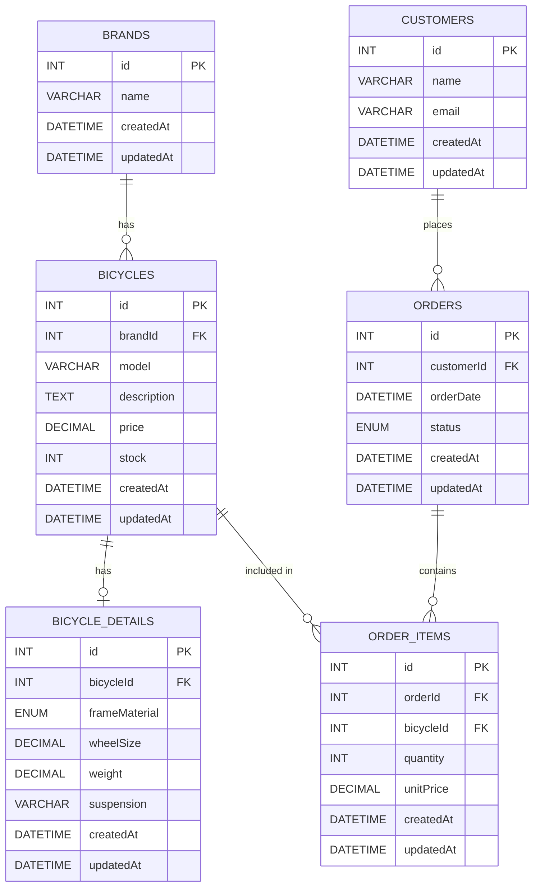

# Bicycle Shop

## Project Description

This project is a full-stack bicycle shop application developed as a learning project. It provides a REST API for managing bicycles, brands, bicycle details, customers, orders, and order items, together with a React frontend that consumes the API.

The backend is built with **TypeScript, Express, Sequelize, and MySQL**. The frontend is built with **TypeScript, React, Vite, and Tailwind CSS**.

The application demonstrates CRUD operations, Sequelize model relationships, eager loading, filtering, and communication between a React frontend and an Express backend.

**Author:** Sergio Domínguez Castro

---

## Getting Started

These instructions will get you a copy of the project running on your local machine for development and testing purposes.

### Prerequisites

Before starting the project, make sure you have the following installed:

- Git
- Node.js
- npm
- MySQL

A recent Node.js version compatible with the installed Vite version is recommended.

You also need a running MySQL server and a MySQL user with permission to create and modify tables in the project database.

---

## Project Structure

The project is divided into two main applications:

```text
bicycle-shop-dsw-entrega-05/
├── backend/
│   ├── src/
│   │   ├── config/
│   │   ├── middlewares/
│   │   ├── models/
│   │   ├── modules/
│   │   │   ├── bicycles/
│   │   │   ├── bicycle-details/
│   │   │   ├── brands/
│   │   │   ├── customers/
│   │   │   ├── orders/
│   │   │   └── order-items/
│   │   ├── routes/
│   │   ├── app.ts
│   │   └── server.ts
│   └── package.json
│
└── frontend/
    ├── src/
    │   ├── components/
    │   ├── features/
    │   │   └── bicycles/
    │   ├── services/
    │   └── App.tsx
    └── package.json
```

The backend follows a modular structure where each main resource contains its own model, service, controller, and routes.

The frontend currently contains the bicycle management feature, including listing, creating, updating, and deleting bicycles.

---

## Database Design

The application uses MySQL through Sequelize ORM.

The main database entities are:

- `brands`
- `bicycles`
- `bicycle_details`
- `customers`
- `orders`
- `order_items`

The following Mermaid diagram represents the database tables and their relationships:



### Relationships

- A **Brand** can have many **Bicycles**.
- A **Bicycle** belongs to one **Brand**.
- A **Bicycle** can have one **BicycleDetail**.
- A **Customer** can have many **Orders**.
- An **Order** belongs to one **Customer**.
- An **Order** can contain many **OrderItems**.
- A **Bicycle** can appear in many **OrderItems**.
- `OrderItem` acts as the intermediate entity between `Order` and `Bicycle`.

---

## Database Tables

### Brands

| Column | Type | Description |
|---|---|---|
| `id` | INTEGER | Primary key |
| `name` | VARCHAR(150) | Brand name |
| `createdAt` | DATETIME | Creation timestamp |
| `updatedAt` | DATETIME | Last update timestamp |

### Bicycles

| Column | Type | Description |
|---|---|---|
| `id` | INTEGER | Primary key |
| `brandId` | INTEGER | Related brand |
| `model` | VARCHAR(150) | Bicycle model |
| `description` | TEXT | Optional description |
| `price` | DECIMAL(10,2) | Bicycle price |
| `stock` | INTEGER | Available stock |
| `createdAt` | DATETIME | Creation timestamp |
| `updatedAt` | DATETIME | Last update timestamp |

### Bicycle Details

| Column | Type | Description |
|---|---|---|
| `id` | INTEGER | Primary key |
| `bicycleId` | INTEGER | Related bicycle |
| `frameMaterial` | ENUM | Aluminum, Carbon, Steel, or Titanium |
| `wheelSize` | DECIMAL(4,1) | Wheel size |
| `weight` | DECIMAL(5,2) | Bicycle weight |
| `suspension` | VARCHAR(80) | Optional suspension information |
| `createdAt` | DATETIME | Creation timestamp |
| `updatedAt` | DATETIME | Last update timestamp |

### Customers

| Column | Type | Description |
|---|---|---|
| `id` | INTEGER | Primary key |
| `name` | VARCHAR(150) | Customer name |
| `email` | VARCHAR(160) | Customer email |
| `createdAt` | DATETIME | Creation timestamp |
| `updatedAt` | DATETIME | Last update timestamp |

Both `name` and `email` are unique.

### Orders

| Column | Type | Description |
|---|---|---|
| `id` | INTEGER | Primary key |
| `customerId` | INTEGER | Related customer |
| `orderDate` | DATETIME | Order date |
| `status` | ENUM | pending, paid, shipped, or cancelled |
| `createdAt` | DATETIME | Creation timestamp |
| `updatedAt` | DATETIME | Last update timestamp |

### Order Items

| Column | Type | Description |
|---|---|---|
| `id` | INTEGER | Primary key |
| `orderId` | INTEGER | Related order |
| `bicycleId` | INTEGER | Related bicycle |
| `quantity` | INTEGER | Quantity ordered |
| `unitPrice` | DECIMAL(10,2) | Price per unit |
| `createdAt` | DATETIME | Creation timestamp |
| `updatedAt` | DATETIME | Last update timestamp |

`quantity` must be at least `1`, and `unitPrice` cannot be negative.

---

## API

The backend exposes its REST API under:

```text
http://localhost:3000/api
```

### Health Check

```http
GET /
```

Returns a simple message indicating that the API is operational.

### Bicycles

```http
GET    /api/bicycles
GET    /api/bicycles/:id
GET    /api/bicycles/eagerly/:id
GET    /api/bicycles/eagerly/frame-material/:frameMaterial
POST   /api/bicycles
PUT    /api/bicycles/:id
DELETE /api/bicycles/:id
```

The eagerly loaded endpoints retrieve bicycle information together with its related data.

### Bicycle Details

```http
GET    /api/bicycle-details
GET    /api/bicycle-details/:id
GET    /api/bicycle-details/eagerly/:id
POST   /api/bicycle-details
PUT    /api/bicycle-details/:id
DELETE /api/bicycle-details/:id
```

### Brands

```http
GET    /api/brands
GET    /api/brands/:id
POST   /api/brands
PUT    /api/brands/:id
DELETE /api/brands/:id
```

### Customers

```http
GET    /api/customers
GET    /api/customers/:id
GET    /api/customers/:name_search/orders
POST   /api/customers
PUT    /api/customers/:id
DELETE /api/customers/:id
```

The customer search endpoint can retrieve customers and their orders using a name search.

### Orders

```http
GET    /api/orders
GET    /api/orders/:id
GET    /api/orders/customers/:id
POST   /api/orders
PUT    /api/orders/:id
DELETE /api/orders/:id
```

### Order Items

```http
GET    /api/order-items
GET    /api/order-items/:id
GET    /api/order-items/order/:orderId
POST   /api/order-items
PUT    /api/order-items/:id
DELETE /api/order-items/:id
```

---

## Installation

### 1. Create the database

Open MySQL:

```bash
mysql -u root -p
```

Create the database:

```sql
CREATE DATABASE IF NOT EXISTS db_bicycle_shop
CHARACTER SET utf8mb4;
```

The database must exist before starting the backend.

> The current server configuration uses `sequelize.sync({ force: true })`. This means that the Sequelize tables are recreated when the backend starts. Do not use this configuration with production data.

### 2. Configure the backend

Create a `.env` file inside `backend/`:

```dotenv
PORT=3000

DB_HOST=localhost
DB_PORT=3306
DB_NAME=db_bicycle_shop
DB_USER=your-database-username
DB_PASSWORD=your-database-password
```

Replace the database username and password with your local MySQL credentials.

### 3. Configure the frontend

Create a `.env` file inside `frontend/`:

```dotenv
VITE_API_URL=http://localhost:3000/api
```

The frontend uses this variable as the base URL for its API requests.

### 4. Install dependencies

Install backend dependencies:

```bash
cd backend
npm ci
```

Install frontend dependencies:

```bash
cd ../frontend
npm ci
```

---

## Running the Application

The backend and frontend should be started separately.

### Start the backend

From the `backend` directory:

```bash
npm run dev
```

The API will run on:

```text
http://localhost:3000
```

The API base path is:

```text
http://localhost:3000/api
```

### Start the frontend

From the `frontend` directory:

```bash
npm run dev
```

Vite will display the local development URL in the terminal, normally:

```text
http://localhost:5173
```

Open that URL in a browser to use the application.

---

## Available Scripts

### Backend

```bash
npm run dev
```

Starts the backend in development mode using `tsx`.

```bash
npm run build
```

Compiles the TypeScript backend.

```bash
npm run start
```

Starts the compiled backend from the `dist` directory.

### Frontend

```bash
npm run dev
```

Starts the Vite development server.

```bash
npm run build
```

Builds the frontend for production.

```bash
npm run lint
```

Runs Oxlint.

```bash
npm run preview
```

Previews the production build locally.

---

## Running the Tests

No automated test suite is currently configured in the project.

The available validation commands are:

### Backend build

```bash
cd backend
npm run build
```

This checks that the backend TypeScript code can be compiled successfully.

### Frontend build

```bash
cd frontend
npm run build
```

This runs the TypeScript build and creates the Vite production bundle.

### Frontend lint

```bash
cd frontend
npm run lint
```

This runs Oxlint against the frontend source code.

---

## Built With

### Backend

- **TypeScript** — programming language.
- **Express** — web framework for the REST API.
- **Sequelize** — ORM used to communicate with MySQL.
- **MySQL2** — MySQL driver for Node.js.
- **CORS** — cross-origin resource sharing middleware.
- **dotenv** — environment variable configuration.
- **tsx** — TypeScript development runner.

### Frontend

- **TypeScript** — programming language.
- **React** — user interface library.
- **Vite** — frontend development and build tool.
- **Tailwind CSS** — styling framework.
- **Oxlint** — frontend linting.

---

## Architecture

The backend follows a modular architecture.

Each domain is organized into separate modules containing the necessary layers:

```text
Module
├── Model
├── Service
├── Controller
└── Routes
```

For example:

```text
backend/src/modules/bicycles/
├── bicycle.model.ts
├── bicycle.service.ts
├── bicycle.controller.ts
└── bicycle.routes.ts
```

The Express application registers all resource routers under `/api`.

---

## Error Handling

The backend includes middleware for:

- Handling routes that do not exist.
- Handling application errors.
- Returning JSON responses from the API.

CORS is also enabled so that the React frontend can communicate with the backend during development.

---

## Deployment

For a production deployment, the following points should be considered:

1. Configure production environment variables.
2. Use a production MySQL database.
3. Build the backend:

```bash
cd backend
npm run build
```

4. Start the compiled backend:

```bash
npm run start
```

5. Build the frontend:

```bash
cd frontend
npm run build
```

6. Serve the generated frontend files using an appropriate web server.

7. Change the Sequelize synchronization strategy before using production data. The current configuration uses:

```typescript
sequelize.sync({ force: true })
```

This recreates the database tables when the backend starts and can therefore delete existing data.

---

## Contributing

Contributions are welcome.

A typical contribution workflow is:

1. Create a new branch.
2. Make the required changes.
3. Verify that the backend builds correctly.
4. Verify that the frontend builds and passes linting.
5. Commit the changes.
6. Open a pull request.

---

## Versioning

The project currently uses version `1.0.0` in the backend and `0.0.0` in the frontend package configuration.

---

## Author

**Sergio Domínguez Castro**

---

## License

The project does not currently specify a dedicated license file or license in the README.

---

## Acknowledgments

This project was developed as a learning exercise focused on:

- REST API development.
- TypeScript.
- Express.
- Sequelize and relational database modeling.
- MySQL.
- React.
- Vite.
- Frontend/backend integration.
